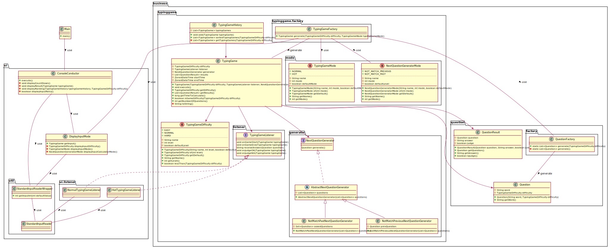

# typing-game

タイピングゲーム演習をオブジェクト指向で実装したサンプルです。

## クラス図

## 変更履歴

- タイピングゲーム実装 [UML](docs/01_implement_typing_game.svg) [タグ](https://github.com/yoichi-nakao/typing-game/tree/01-implement-typing-game)
- stream を使って書き換え [UML](docs/02_apply_stream_api.svg) [タグ](https://github.com/yoichi-nakao/typing-game/tree/02-apply-stream-api) [差分](https://github.com/yoichi-nakao/typing-game/commit/778d6946296b27d9e6cbae6d2c55ae462eb235b1)
- ランキングに開始時刻を表示 [UML](docs/03_display_ranking_starttime.svg) [タグ](https://github.com/yoichi-nakao/typing-game/tree/03-display-ranking-starttime) [差分](https://github.com/yoichi-nakao/typing-game/commit/8166c8dcc598a791eb53a16e98868792a6c299f6)
- 回答履歴を表示 [UML](docs/04_display_question_history.svg) [タグ](https://github.com/yoichi-nakao/typing-game/tree/04-display-question-history) [差分](https://github.com/yoichi-nakao/typing-game/commit/44916a6dc77eb46d0b3f8832a5192447ab0b181f)
- TypingGame.execute の標準入出力部分を外部化 [UML](docs/05_externalization_typinggame_standard_io.svg) [タグ](https://github.com/yoichi-nakao/typing-game/tree/05-externalization-typinggame-standard-io) [差分](https://github.com/yoichi-nakao/typing-game/commit/84ebbfbaa035ce6c946f5fb37014e52a21aa3b44)
  - TypingGame から標準入出力を切り離すため、TypingGameListener（インターフェース） を導入した。（依存関係逆転の原則）
- パッケージを構成してクラスを配置 [UML](docs/06_configure_package.svg) [タグ](https://github.com/yoichi-nakao/typing-game/tree/06-configure-package) [差分](https://github.com/yoichi-nakao/typing-game/commit/f972a574952c24a44e9e6ad73dbf08d61f321a9c)
  - TypingGame から標準入出力が切り離されたので、パッケージを UI 部分（ui パッケージ）とビジネスロジック部分（business パッケージ）に分けた
- アツいゲームモードを実装 [UML](docs/07_add_hot_typinggame_mode.svg) [タグ](https://github.com/yoichi-nakao/typing-game/tree/07-add-hot-typinggame-mode) [差分](https://github.com/yoichi-nakao/typing-game/commit/30ba9c1c7b0d7f34fc8c60657dfbdaf4c4e44166)
  - TypingGameListener により、TypingGame の標準入出力部分の実装が切り替え易くなったので、新しいゲームモードを導入した。
- TypingGame.execute の次の問題の生成部分を外部化 [UML](docs/08_externalization_question_generator.svg) [タグ](https://github.com/yoichi-nakao/typing-game/tree/08-externalization-question-generator) [差分](https://github.com/yoichi-nakao/typing-game/commit/4fbd153ff4ad2df7f4032911d3efe810faea0eda)
  - TypingGame から次の問題を生成する処理を切り離すため、NextQuestionGenerator（インターフェース） を導入した。
- 過去の問題と一致しない出題方法を実装 [UML](docs/09_add_not_match_past_mode.svg) [タグ](https://github.com/yoichi-nakao/typing-game/tree/09-add-not-match-past-mode) [差分](https://github.com/yoichi-nakao/typing-game/commit/efd279f2abadaeb9d2fe30a11a65b2085e627a19)
  - NextQuestionGenerator により、TypingGame の次の問題を生成する処理が切り替え易くなったので、新しい問題生成モードを導入した。
- ConsoleConductor が肥大化してきたのでモード入力を別クラスに分離 [UML](docs/10_separate_input_mode.svg) [タグ](https://github.com/yoichi-nakao/typing-game/tree/10-separate-input-mode) [差分](https://github.com/yoichi-nakao/typing-game/commit/35de1f936160893d8be8c4818f6dd4fed5afbd92)
- business パッケージを再構成 [UML](docs/11_reconfigure_business_package.svg) [タグ](https://github.com/yoichi-nakao/typing-game/tree/11-reconfigure-business-package) [差分](https://github.com/yoichi-nakao/typing-game/commit/eca1a44d2b89bab92470013fcbb0c86194c844c1)
  - ui 及び business パッケージ配下のパッケージ・クラス構成を整理した。考える基準は、同じ目的のクラスは近くなるように、くらい。

## このプログラムを書くにあたって参考にしている考え方が学べる本

- [リーダブルコード ―より良いコードを書くためのシンプルで実践的なテクニック (Theory in practice)](https://www.mamezou.tv/n-fresh-hrd/mod/url/view.php?id=2960)
- [Java 言語で学ぶデザインパターン入門第 3 版](https://www.mamezou.tv/n-fresh-hrd/mod/url/view.php?id=2969)
- [現場で役立つシステム設計の原則 ~変更を楽で安全にするオブジェクト指向の実践技法](https://www.mamezou.tv/n-fresh-hrd/mod/url/view.php?id=2962)
